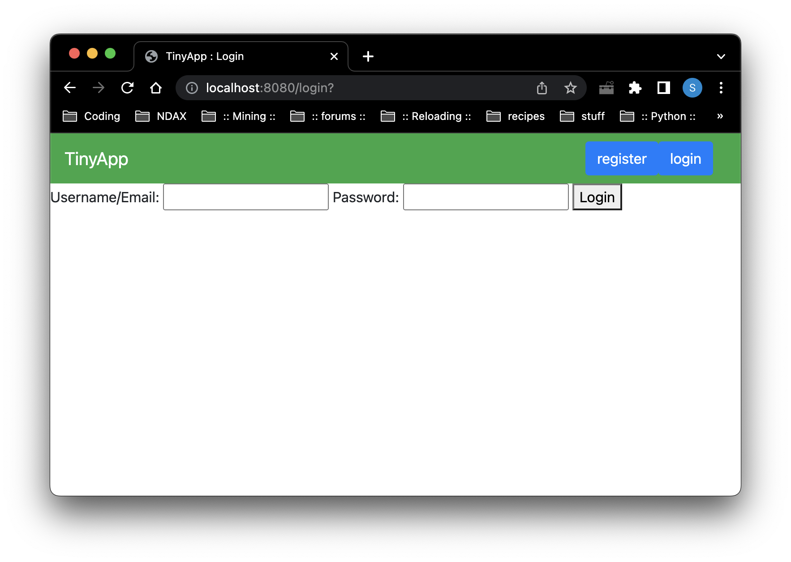
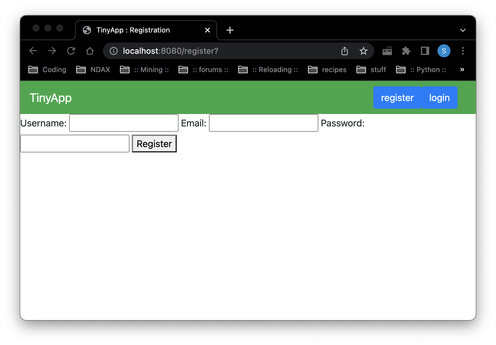
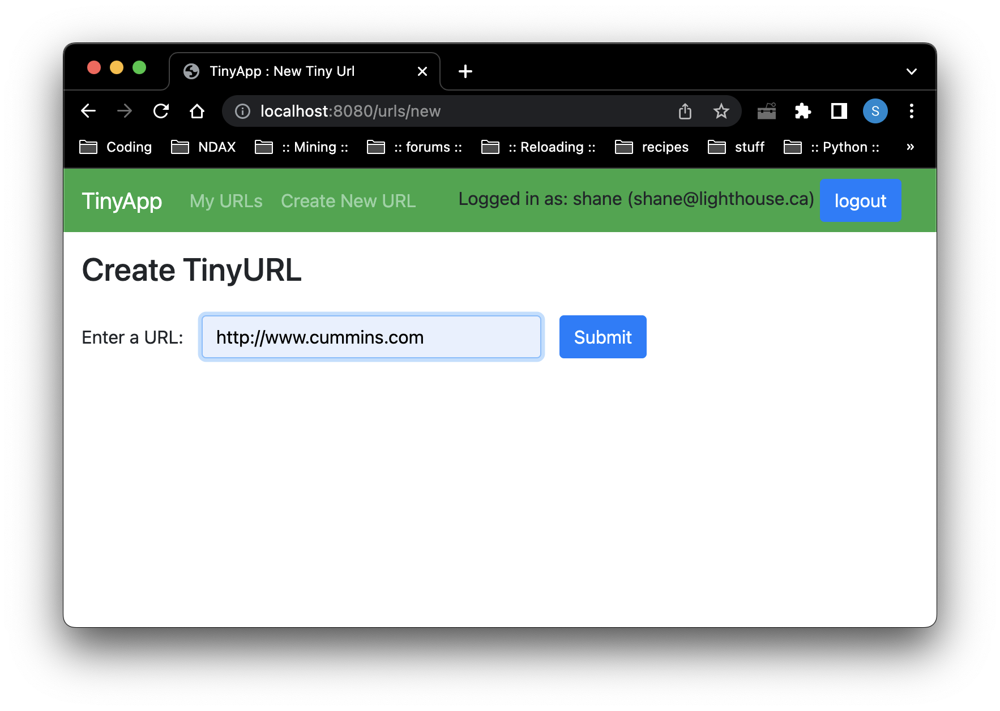
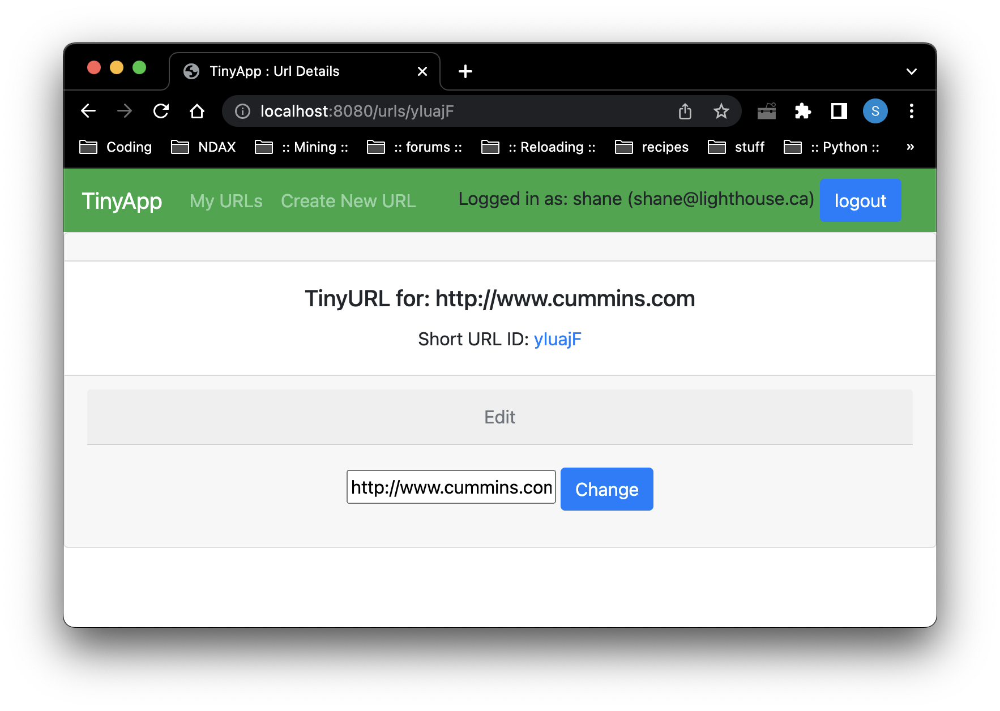
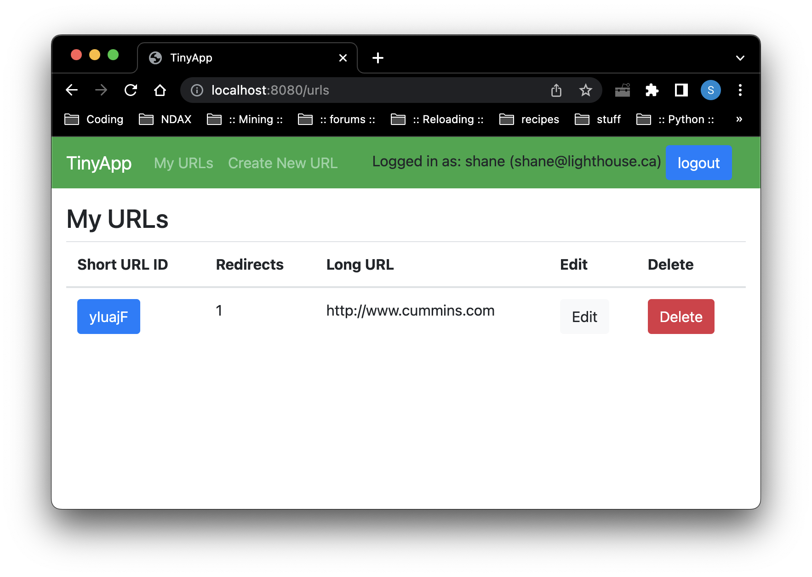

# TinyApp : Url Shortener

A web app to provide url shortening for messages that have character limits.

## Purpose

**_BEWARE:_ This library was published for learning purposes. It is _not_ intended for use as production-grade software.**

The tinyapp url shortener is an educational project to help expand this students understanding of creating a node webserver and deploying a simple web app.

I intentionally avoided html/css polishing because I am not yet experienced enough to make that an intelligent use of my time.  Instead I focused on consolidated and simplifying my code.

## Requirements

Node v12

## Installation

Fork the [repository](https://github.com/navycuda/tinyapp) and clone it.

```bash
npm install
```

## Usage

### With nodemon

```bash
npm start
```

* `Starts a server instance with the nodemon.`

```bash
node express_server.js
```

* `Starts a server instance without the nodemon.`

## Documentation

### Important!

TinyApp : Url Shortener does not have any database or other means of storing its database long term.  Currently both the url and user database are held within memory during the loaded server session.  If the server is shut down, or otherwise goes offline the user and url databases are emptied.

User accounts are randomly assigned user id's, so session cookies from previous instances of the server will not continue to work.

### Basic Usage

Sign up for the service, then create shortened urls.  Shortened urls are owned by the creator and can be edited or deleted by the owner only.  Shortened urls can be used by anyone.

|  |
|:--:|
| `Login Page` This is the page the user logs in, using either their email or username |

|  |
|:--:|
| `Registration Page` This is the page a new user signs up for the url service. |

|  |
|:--:|
| `Create Url` The page to create a new url for the users personal index |

|  |
|:--:|
| `Edit Url` If the redirect to address needs to be modifed, this is the page for that. |

|  |
|:--:|
| `Url Index` The list of shortened urls maintained by this user. |